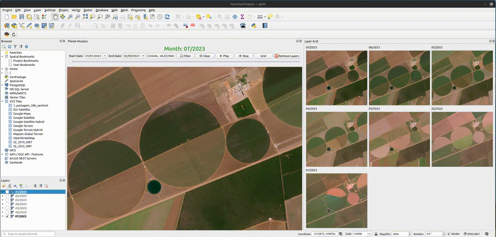

# Planet Mosaic Explorer for QGIS (PME)

## Description

This Python code provides a custom QGIS plugin widget that allows users to interact with time-series mosaics from Planet's API. It includes functionalities like filtering mosaics by date, zooming to a specific point, and a time-lapse feature that plays through the mosaics in time order. Additionally, it includes a Layer Grid view to display small previews of all layers in a grid.

## Features

- Filter Planet's mosaics by date range
- Time-lapse playback through the mosaics
- Zoom to a specific point
- Layer Grid for a quick overview
- Play, Stop, and Remove Layers buttons

## Prerequisites

Make sure you have QGIS installed on your system.

You'll also need a Planet API Key which should be set in the code as `PLANET_API_KEY`.

## Install via Python Console
1. Open QGIS.
2. Open the Python Console (`Plugins -> Python Console` or press `Ctrl+Alt+P`).
3. Go to the `Show Editor` tab.
4. Copy-paste the script `pme.py` into the editor and run it.

## Usage

1. Open the widget from your QGIS interface.
2. Use the date filters to set a start and end date for the mosaics.
3. Optionally, enter coordinates to zoom to a specific point.
4. Use the Play button to start a time-lapse through the mosaics.
5. Use the Stop button to stop the time-lapse.
6. Use the Grid button to view a grid of all layers.
7. Use the Remove Layers button to remove all the current layers from the project.

## API Reference

This code uses the Planet Basemaps API for fetching the mosaics. More information can be found at [Planet's API Documentation](https://developers.planet.com/docs/basemaps/).

## License

This project is open source and available under the MIT License.

## Acknowledgements

- **QGIS**: This plugin would not have been possible without the robust and open-source capabilities of QGIS. Special thanks to the QGIS development community for providing the software and resources that make advanced geospatial analysis accessible. More information about QGIS can be found on their [official website](https://qgis.org/).

- **NICFI - Norway's International Climate and Forests Initiative Satellite Data Program**: This initiative provides valuable satellite data to the global community for the betterment of climate and forest management. The Planet mosaics used in this project are accessed through the NICFI program. We extend our gratitude to NICFI for making high-quality geospatial data more accessible and for their commitment to addressing climate change and sustainable forest management. For more details on NICFI, visit [Planet's NICFI Program](https://www.planet.com/nicfi/).

Your support and contributions greatly enhance the functionality and reach of this project.

